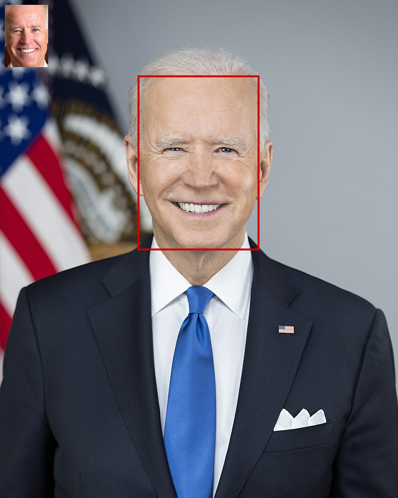

# Amazon Rekognition Face Search Sample
This sample tries the following:

1. Indexing faces in an Amazon Rekognition face collection
2. Searching for faces detected in an image


## Usage
### Indexing faces
```shell
python index_faces.py \
  --collection-id test-collection \
  "images/portraits/Donald_Trump_official_portrait.jpg" \
  "images/portraits/Joe_Biden_presidential_portrait.jpg"
```

### Searching for faces
You can check result images in `images/results/` directory.

```shell
python search_faces.py \
  --collection-id test-collection \
  "images/Official_portrait_of_President_Obama_and_Vice_President_Biden_2012.jpg" \
  "images/P20211101AS-0357_(51846489866).jpg"
```

### Cleaning up the face collection
```shell
aws rekognition delete-collection --collection-id test-collection
```

---

## Sample images
All sample images in this repository are under [public domain](https://en.wikipedia.org/wiki/Public_domain).

- https://commons.wikimedia.org/wiki/File:Donald_Trump_official_portrait.jpg
- https://commons.wikimedia.org/wiki/File:Joe_Biden_presidential_portrait.jpg
- https://commons.wikimedia.org/wiki/File:Official_portrait_of_President_Obama_and_Vice_President_Biden_2012.jpg
- https://commons.wikimedia.org/wiki/File:P20211101AS-0357_(51846489866).jpg

Sample result images are stored in `images/results` directory.

One of those is here. You can find an image to be used for searching on upper-left.


